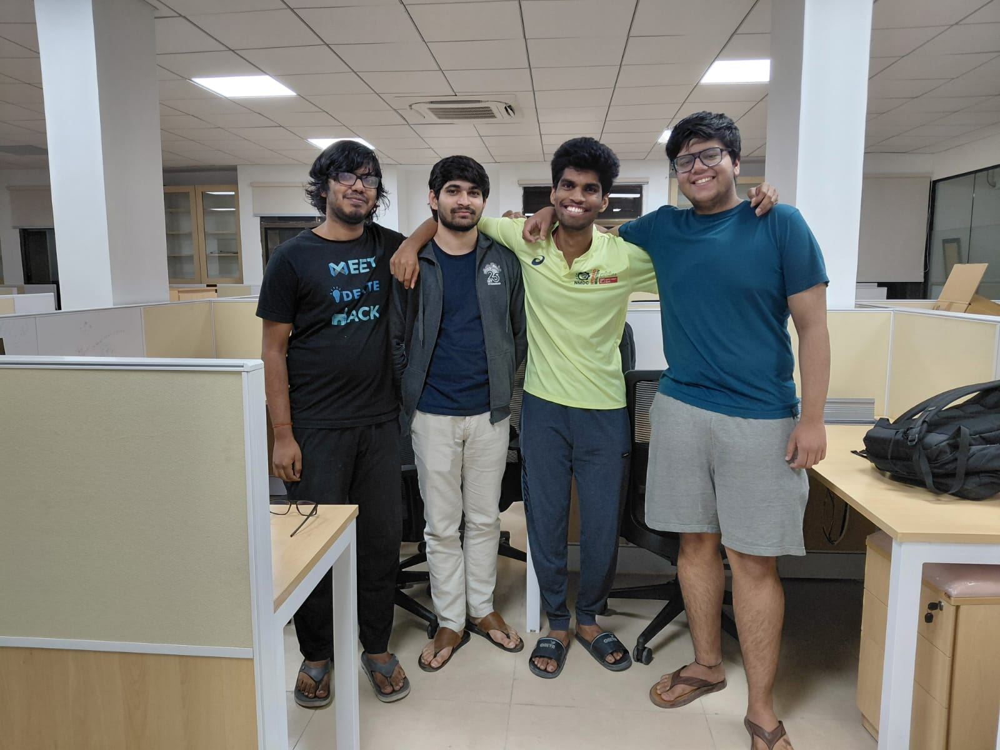

## MIT iQuHack 2026

This one is more of a personal update. Around a similar time last semester, I was lost in my Quantum Error Correction class. I understood things because of some background in classical error correction, but other than that, it was mostly an algebraic mess in my head. Right before the midsem, one of my friends (who shall be referred to as R from here on in) sat me down and explained everything to me. Over the semester, R and I sat together multiple times to discuss QECC concepts - stabilisers, CSS codes, topological codes and whatnot. All of these discussions were in the room A3-210. Hence, they were creatively called "A3-210 sessions". Clearly, I would not have been able to survive that course without R. A lot of it is still a mess in my head, but I am comfortable up to an operational level.

I initially took the elective to clear off a stream elective requirement. However, it ended up getting me extremely interested in quantum information and quantum computation. Also, at the time, half the people who sat in the same lab as me worked on quantum stuff. So that, of course, skewed my opinions. Courses can, in fact, be pivotal steps. Especially the ones that make you uncomfortable. (Another one of those was Real Analysis, but that is for another day)

This year, our team took part in the MIT iQuHack (unfortunately, no R in the team). We picked the problem given by Superquantum. It has been proved that one can approximate any unitary to an arbitrary precision by using only a few types of gates (kind of like NAND gates can be used to do any digital operation). The only catch is that one of the gates has to be a non-Clifford gate. Non-Clifford gates are notoriously problematic when considering fault-tolerant quantum computation. So the task was that given 12 unitaries, approximate all of them using the gates H, S, CNOT and T, while minimising the number of T gates (T gates are non-Clifford). It was 24 hours of trying to decompose matrices. I haven't had this much fun in a while. Our team "roman_kangaroos" ended up coming third in the hackathon. Straight up fire experience. 

  
  

    Team roman_kangaroos
  

